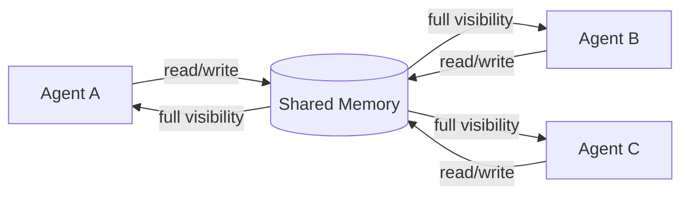
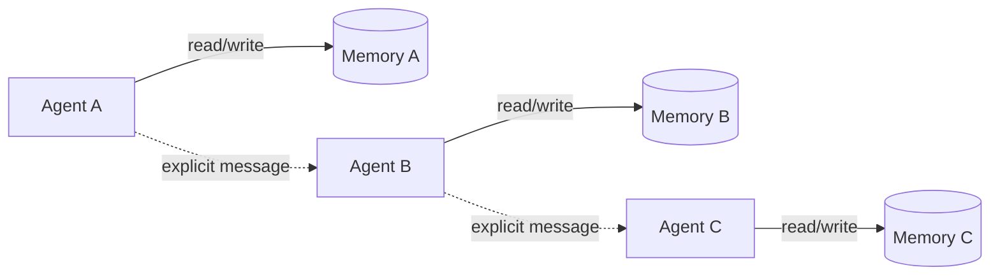
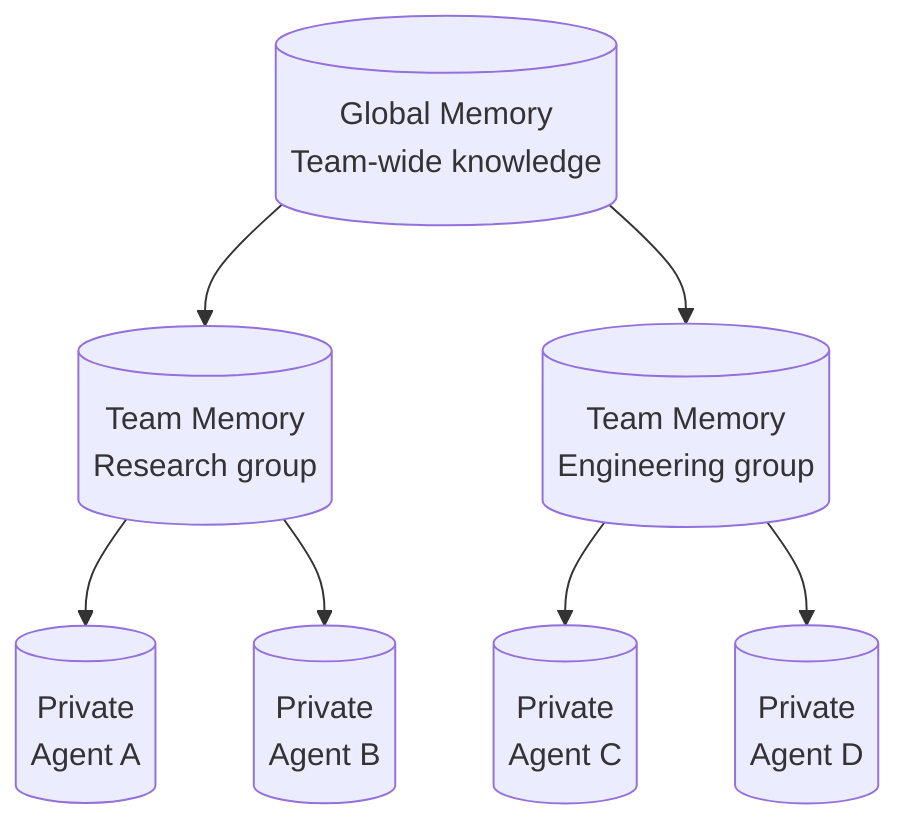

## Executive Summary

Memory is the central unsolved problem in multi-agent AI systems. While single-agent memory is relatively straightforward -- store context, retrieve when relevant -- multi-agent memory introduces coordination, consistency, isolation, and security challenges that mirror decades of distributed systems research. Gartner reported a 1,445% surge in multi-agent system inquiries from early 2024 to mid-2025, and Anthropic's own evaluations show that multi-agent systems with proper memory architecture outperform single-agent setups by over 90% on research tasks. Yet 41-87% of multi-agent LLM systems still fail in production, with 79% of failures rooted in coordination issues rather than technical bugs.

This research examines how state-of-the-art frameworks handle memory across agent boundaries, comparing shared, isolated, and hierarchical patterns. Key findings:

- **Shared memory is essential but dangerous.** Every major framework provides some form of shared state, but uncontrolled sharing creates noise, contamination, and security risks. The emerging consensus is scoped sharing -- global by default with namespace isolation for sensitive contexts.
- **Hierarchical memory is converging on a three-layer model:** global (team-wide knowledge), group/role (task-scoped), and private (agent-specific). CrewAI, MemOS, and the Collaborative Memory research all independently arrived at variations of this pattern.
- **Conflict resolution remains primitive.** Most frameworks use last-write-wins or orchestrator-mediated serialization. Event sourcing and CRDT-inspired approaches exist in research but are not yet mainstream in agent frameworks.
- **Storage backends are consolidating.** The "polyglot persistence" anti-pattern (separate vector DB, graph DB, relational DB, file system) is giving way to unified platforms -- PostgreSQL with pgvector, MongoDB with Atlas Vector Search, or specialized memory layers like Mem0.
- **Security is the biggest gap.** Most frameworks have no built-in access control on memory. Enterprise deployments require tenant isolation, provenance tracking, and least-privilege memory access that current tools largely leave to implementers.

## The Three Memory Patterns

Multi-agent memory architectures fall along a spectrum from fully shared to fully isolated, with hierarchical designs occupying the practical middle ground.

### Shared Memory

In shared-state systems, all agents read from and write to a common memory store. This is the simplest model and the default in most frameworks.

**How it works:** A centralized state object (LangGraph), shared context variables (OpenAI Swarm), or crew-level memory store (CrewAI) serves as the single source of truth. Any agent can read any memory, and writes are immediately visible to all other agents.

**When it works well:** Small teams (2-5 agents), pipeline architectures where agents process sequentially, and tasks where every agent genuinely needs full context.

**When it breaks down:**
- **Noise amplification.** When every agent sees everything, irrelevant information crowds out useful context. A code-review agent does not need the sales pipeline data that a CRM agent wrote.
- **Contamination risk.** One agent's hallucinated or incorrect memory entry pollutes every other agent's context.
- **Security violations.** Shared memory makes it impossible to enforce data boundaries -- a compliance requirement in regulated industries.



### Isolated Memory

Each agent maintains its own private memory store, invisible to other agents. Communication happens only through explicit message passing.

**How it works:** Agents operate in separate contexts with no shared state. When Agent A needs information from Agent B, it must request it through a defined interface -- a function call, message queue, or orchestrator relay.

**When it works well:** Security-sensitive deployments, agents with fundamentally different domains, and scenarios where cross-contamination risk outweighs coordination benefits.

**When it breaks down:**
- **Duplication.** Multiple agents independently discover and store the same information.
- **Coordination overhead.** Every piece of shared knowledge requires explicit communication, increasing token usage and latency.
- **Divergence.** Without shared ground truth, agents can develop contradictory understandings of the same situation.



### Hierarchical Memory

The practical middle ground: memory is organized into layers with different visibility scopes. This is where the industry is converging.

**How it works:** Memory is segmented into tiers -- typically global, group/role, and private. Agents access the tiers appropriate to their role and current task. A researcher agent reads from global knowledge and its own private notes; it cannot see the private memory of the editor agent, but both share the project-level memory.

**When it works well:** Most real-world multi-agent deployments. It balances coordination efficiency with isolation guarantees.



## Framework Implementations Compared

### CrewAI: Unified Memory with Scope Trees

CrewAI's memory system underwent a significant redesign in 2025, replacing four separate memory types (short-term, long-term, entity, contextual) with a single unified `Memory` class. This is the most mature hierarchical memory implementation among current agent frameworks.

**Architecture:** Memories organize into a tree-like hierarchy of scopes (e.g., `/project/alpha`, `/agent/researcher`). The system uses an LLM to automatically infer scope placement when not explicitly specified. Retrieval uses composite scoring that blends semantic similarity (weight: 0.5), recency decay (weight: 0.3), and importance (weight: 0.2).

**Sharing model:** When a crew enables memory, all agents share one central store by default. Individual agents can be restricted to scoped views:

```python
from crewai import Memory, Agent, Crew

memory = Memory(recency_weight=0.5, recency_half_life_days=7)

# Researcher sees only its scope
researcher = Agent(
    role="Researcher",
    memory=memory.scope("/agent/researcher")
)

# Writer sees broader crew memory
writer = Agent(
    role="Writer",
    memory=memory.scope("/crew/writing-project")
)

# Multi-branch access via slices
view = memory.slice(
    scopes=["/agent/researcher", "/company/knowledge"],
    read_only=True
)
```

**Storage:** Default backend is LanceDB, persisting under `.crewai/memory/`. Custom backends are supported via the `StorageBackend` protocol.

**Conflict handling:** Automatic consolidation detects duplicate records above a configurable similarity threshold (default 0.85) and merges them. Non-blocking saves via `remember_many()` operate asynchronously.

### LangGraph: Reducer-Driven State with Checkpointing

LangGraph takes a fundamentally different approach -- memory is not a separate system but the graph state itself, transformed through explicit reducer functions.

**Architecture:** State is defined as a TypedDict with annotated reducer functions. Each node in the graph returns partial state updates; LangGraph merges them deterministically via reducers. This eliminates the "who wrote last" ambiguity by making merge semantics explicit and type-safe.

```python
from typing import Annotated, TypedDict
from operator import add
from langgraph.graph import StateGraph
from langgraph.graph.message import add_messages

class AgentState(TypedDict):
    messages: Annotated[list, add_messages]  # Deduplicates by ID
    findings: Annotated[list, add]           # Concatenates
    task_count: Annotated[int, add]          # Sums

graph = StateGraph(AgentState)
```

**Checkpointing:** Built-in persistent checkpointers (PostgresSaver, SQLiteSaver) save state after each graph step. This enables "time-travel" -- rolling back to any prior state and replaying execution with different parameters. Checkpoints are thread-scoped, providing natural isolation between conversation threads.

**Multi-agent coordination:** LangGraph's centralized state acts as shared memory accessible to all nodes. Parallel node execution is supported through deterministic reducer merging -- when two parallel branches update the same key, the reducer defines exactly how updates combine. This avoids race conditions by design rather than by locking.

**Long-term memory:** Cross-session persistence is handled through external stores (databases, vector stores) that agents query and update explicitly, separate from the graph state.

### AutoGen / Microsoft Agent Framework: Session-Based State

Microsoft's Agent Framework (the production evolution of AutoGen) combines conversational memory with structured state management.

**Architecture:** The framework unifies AutoGen's agent abstractions with Semantic Kernel's enterprise features. Memory management operates at the session level, with graph-based workflows providing explicit control over multi-agent execution paths.

**State management:** Sessions maintain conversational history and structured state that persists across human-in-the-loop interactions. Cross-agent memory sharing is supported but requires explicit configuration -- agents do not share memory by default.

**Enterprise focus:** The framework emphasizes middleware, telemetry, and type safety over flexible memory patterns. Memory is a component that plugs into the pipeline rather than the central architectural concept.

### OpenAI Swarm / Agents SDK: Minimal Memory by Design

OpenAI's approach is deliberately minimal -- the framework provides coordination primitives but leaves memory to the implementer.

**Architecture:** Swarm's `context_variables` dictionary provides shared state across agent handoffs. The `run()` function is stateless between calls (analogous to `chat.completions.create()`), though it maintains conversation history within a run.

**Handoff pattern:** When an agent hands off to another, the full conversation history and context variables transfer automatically. This is pure shared memory with no isolation -- every agent in the chain sees everything.

**Production evolution:** The OpenAI Agents SDK (March 2025) adds tracing, guardrails, and sessions on top of the same minimal memory philosophy. Persistent memory must be implemented externally.

### Anthropic's Multi-Agent Research System: Artifact-Based Memory

Anthropic's production multi-agent system reveals a pragmatic approach to memory that prioritizes context window efficiency.

**Architecture:** A LeadResearcher agent coordinates specialized subagents. Rather than sharing memory through a common store, agents communicate through an "artifact system" -- subagents store work products in external storage and return lightweight references to the coordinator. This prevents information degradation through multi-stage processing.

**Context management:** The lead agent saves its research plan to persistent external memory to survive context window truncation (at ~200K tokens). When context limits approach, fresh subagents spawn with clean windows while maintaining continuity through deliberate handoffs with compressed summaries.

**Key insight:** Token usage explains 80% of performance variance in multi-agent systems. Distributing work across separate context windows effectively scales total available token capacity, making memory architecture fundamentally a token economics problem.

## Memory Merge Strategies

When multiple agents write to shared memory concurrently, the system must decide how to reconcile conflicts. Current approaches range from primitive to sophisticated.

### Last-Write-Wins (LWW)

The simplest strategy: the most recent write overwrites any previous value. Used by default in OpenAI Swarm's context_variables and many ad-hoc implementations.

**Problem:** Silently discards information. If Agent A writes "use PostgreSQL" and Agent B simultaneously writes "use MySQL," one decision vanishes without trace.

### Orchestrator-Mediated Serialization

A supervisor agent sequences all memory writes, resolving conflicts before they reach the store. Used in hierarchical architectures where a coordinator agent manages the team.

**Problem:** Creates a bottleneck. The orchestrator becomes a single point of failure and a throughput limiter.

### Reducer Functions (LangGraph)

Each state key has an explicit merge function that defines how concurrent updates combine. List fields concatenate, counters sum, messages deduplicate by ID.

**Advantage:** Deterministic, type-safe, and transparent. Developers declare merge semantics at schema definition time rather than discovering them at runtime.

**Limitation:** Works for structured state but not for free-form semantic memory where the "right" merge is context-dependent.

### LLM-Assisted Consolidation (CrewAI, Mem0)

When new information arrives, an LLM evaluates it against existing memories, identifies duplicates, resolves contradictions, and produces consolidated entries.

**Advantage:** Handles semantic conflicts that structural merges cannot -- for example, reconciling "the deadline is Friday" with "the deadline was moved to next Monday."

**Limitation:** Non-deterministic, adds latency and cost, and introduces the possibility of LLM errors in the merge process itself.

### Event Sourcing

Rather than storing current state, the system stores the sequence of memory operations (writes, updates, deletes) with full provenance. Current state is derived by replaying the event log.

**Advantage:** Complete audit trail, ability to "time-travel" through memory states, and the option to replay with different conflict resolution strategies.

**Limitation:** Complexity. Event replay grows expensive as the log lengthens, and most agent frameworks do not provide event sourcing primitives. LangGraph's checkpointing is the closest mainstream approximation.

## Persona-Scoped Memory and Visibility

Agent identity determines what memory is visible. This is distinct from access control (which is about security) -- persona scoping is about relevance and cognitive load.

### Role-Based Filtering

The most common approach: agents are assigned roles, and memory queries are filtered by role relevance. CrewAI's scope system (`/agent/researcher`, `/crew/project`) implements this pattern directly. The researcher agent's memory.recall() automatically filters to its scope, returning only memories tagged with researcher-relevant scopes.

### Capability-Based Access

Rather than filtering by role, agents receive capability tokens that grant access to specific memory namespaces. This is more flexible than role-based approaches -- an agent can temporarily gain access to another scope without changing its role.

The Collaborative Memory framework (arxiv:2505.18279) formalizes this through dynamic bipartite graphs where user-to-agent and agent-to-resource permissions evolve over time, reflecting organizational changes like role modifications and policy adjustments.

### Context-Adaptive Visibility

MemOS introduces a sophisticated approach where memory visibility adapts based on the current task context. Its MemScheduler uses semantic and LRU-based selection to dynamically determine which memories are relevant to the current operation, effectively creating per-query visibility scopes without static configuration.

## Memory Synchronization Patterns

How do changes in one agent's memory propagate to others?

### Immediate Consistency (Shared State)

All agents read from the same data store. Writes are immediately visible. Used by LangGraph (centralized graph state) and CrewAI (shared memory store).

**Trade-off:** Simple but creates contention under high write loads. Works well when agents take turns (pipeline architecture) but can cause issues with truly parallel execution.

### Event-Driven Propagation

Memory changes emit events that interested agents can subscribe to. Agent-MCP implements this through its knowledge graph -- when one agent updates a node, subscribers receive notifications.

**Trade-off:** Low latency for interested parties, but requires infrastructure (event bus, subscription management) and introduces eventual consistency.

### Checkpoint-Based Synchronization

Agents work independently and periodically sync through checkpoint comparison. LangGraph's checkpointing system enables this pattern -- agents can fork from a shared checkpoint, work independently, and merge results back.

**Trade-off:** Minimizes coordination overhead during work phases but requires explicit merge at synchronization points.

### Polling with Semantic Diffing

Agents periodically query shared memory for changes relevant to their scope. New or modified entries are detected through embedding comparison rather than timestamps.

**Trade-off:** Simple to implement but introduces latency proportional to poll interval. Semantic diffing catches relevant changes even when the exact content is different.

## Storage Backend Comparison

The choice of storage backend fundamentally shapes what memory operations are efficient and what consistency guarantees are possible.

### File-Based Memory

Used by Claude Code's subagent system (MEMORY.md files), early-stage agent prototypes, and configuration-driven systems like Zylos.

**Strengths:**
- Zero infrastructure requirements
- Human-readable and version-controllable (git)
- Natural namespace isolation through directory structure
- Works offline

**Weaknesses:**
- No built-in concurrency control (requires manual file locking)
- No semantic search without additional tooling
- No atomic multi-file operations
- Scaling limits -- performance degrades with thousands of memory files

**When to use:** Single-agent systems, development/prototyping, systems where human auditability matters more than query performance.

### Relational Database (PostgreSQL + pgvector)

The emerging "one database to rule them all" approach for agent memory.

**Strengths:**
- ACID transactions for consistent concurrent access
- pgvector enables semantic search alongside structured queries
- Mature tooling for backup, replication, monitoring
- Row-level security for multi-tenant isolation

**Weaknesses:**
- Schema design required upfront
- Higher operational overhead than file-based approaches
- Vector search performance trails dedicated vector databases at very large scale

**When to use:** Production multi-agent systems, enterprise deployments, systems requiring both structured state and semantic retrieval.

### Vector Database (Chroma, Pinecone, Qdrant, Weaviate)

Optimized for embedding-based similarity search.

**Strengths:**
- Best-in-class semantic retrieval performance
- Purpose-built filtering and metadata queries
- Scales to millions of embeddings

**Weaknesses:**
- Not suitable as sole storage (no transactional guarantees)
- Requires a separate system for structured state
- Operational complexity of managing an additional database

**When to use:** As the semantic retrieval layer in a hybrid architecture, alongside a relational or document database for structured state.

### Document Database (MongoDB)

Flexible schema with integrated vector search via Atlas Vector Search.

**Strengths:**
- Document model maps naturally to memory entries with rich metadata
- Atomic operations provide consistency for concurrent updates
- Atlas Vector Search avoids the need for a separate vector database
- Flexible schema accommodates diverse memory types

**Weaknesses:**
- Weaker transactional guarantees than PostgreSQL for multi-document operations
- Vector search capabilities, while improving, trail dedicated vector databases

**When to use:** Teams already on MongoDB, systems with heterogeneous memory types, rapid prototyping that needs to scale to production.

### Dedicated Memory Layer (Mem0)

Purpose-built memory infrastructure that abstracts away storage decisions.

**Strengths:**
- Single API for memory operations across frameworks (LangGraph, CrewAI, AutoGen)
- Built-in consolidation, deduplication, and graph-enhanced memory
- 91% lower p95 latency vs. full-context approaches
- Managed service option eliminates operational overhead

**Weaknesses:**
- External dependency and potential vendor lock-in
- Less control over storage internals
- Additional cost layer

**When to use:** Teams that want memory as a service rather than building memory infrastructure, multi-framework deployments needing a unified memory layer.

## Security and Access Control

Memory security in multi-agent systems requires addressing threats that do not exist in single-agent architectures.

### Threat Model

- **Cross-agent data leakage:** Agent A accesses memories it should not see (e.g., another tenant's data, PII from a different user conversation)
- **Memory poisoning:** A compromised or misbehaving agent writes malicious content to shared memory, affecting other agents' behavior
- **Provenance loss:** Inability to trace which agent wrote a memory entry, making it impossible to audit or roll back contaminated data
- **Privilege escalation:** An agent uses memory access to gain capabilities beyond its intended scope

### Current Framework Capabilities

| Framework | Built-in ACL | Tenant Isolation | Provenance Tracking | Encryption at Rest |
|-----------|-------------|-----------------|--------------------|--------------------|
| CrewAI | Scope-based | Via scopes | Source tags | Storage-dependent |
| LangGraph | Thread-scoped | Via thread IDs | Checkpoint metadata | Storage-dependent |
| AutoGen/MAF | Session-based | Via sessions | Middleware telemetry | Enterprise config |
| OpenAI Agents SDK | None | None | Tracing | None |
| Mem0 | User/agent ID | Via user scoping | Metadata | Cloud: yes |
| MemOS | MemGovernance | Multi-cube | Full provenance | Yes |

### Implementation Patterns

**Namespace isolation** is the minimum viable security pattern. Every memory operation includes a scope identifier (tenant ID, user ID, agent role), and the memory layer enforces that queries only return results within the caller's scope. CrewAI's scope tree and Mem0's user/agent ID filtering implement this pattern.

**Provenance tracking** attaches immutable metadata to every memory entry: who wrote it, when, from what source, and under what authority. The Collaborative Memory framework (arxiv:2505.18279) demonstrates this through provenance attributes that enable retrospective permission verification -- you can audit after the fact whether a memory access was legitimate given the permissions that were active at the time.

**Write policies** control what enters shared memory. Options include:
- **Allowlisting:** Only explicitly permitted memory types can be shared
- **Anonymization:** PII is stripped before memories enter shared scopes
- **Review gates:** High-sensitivity writes require supervisor approval before becoming visible

**Zero-trust memory access** treats every memory read as potentially unauthorized and verifies permissions at query time rather than relying on cached authorization. This prevents stale permissions from granting access after a role change.

## MemOS: A Glimpse of the Future

MemOS represents the most comprehensive vision for agent memory architecture, treating memory as a first-class operating system concern rather than an application-level afterthought.

**Three memory types unified:**
1. **Parametric Memory** -- knowledge encoded in model weights (LoRA modules, fine-tuning)
2. **Activation Memory** -- transient computational state (KV-caches, attention patterns)
3. **Plaintext Memory** -- explicit external knowledge (documents, graphs, prompts)

**MemCube abstraction:** Every memory unit, regardless of type, is wrapped in a MemCube with standardized metadata: descriptive (timestamps, origin, type), governance (permissions, lifespan, priority), and behavioral (access frequency, relevance scores). This enables uniform operations across heterogeneous memory types.

**Cross-type transformations:** MemOS supports transforming memories between types based on usage patterns. Frequently accessed plaintext memory can be distilled into parametric memory (fine-tuning). Activation patterns can be externalized as plaintext for debugging. This lifecycle management is unique among current frameworks.

**Multi-agent coordination:** The MemStore layer enables publish-subscribe memory sharing between agents, while MemGovernance enforces access policies. This combination provides the flexibility of shared memory with the safety of isolated memory.

## Practical Architecture Recommendations

Based on this analysis, here are concrete recommendations for building multi-agent memory systems.

### For small teams (2-5 agents, single-purpose)

Use shared memory with lightweight scoping. CrewAI's unified memory or LangGraph's centralized state works well. Add scope prefixes to prevent noise but do not over-engineer isolation.

```python
# CrewAI: Simple shared memory with agent scopes
memory = Memory()
crew = Crew(
    agents=[
        Agent(role="Researcher", memory=memory.scope("/research")),
        Agent(role="Writer", memory=memory.scope("/writing")),
    ],
    tasks=[...],
    memory=memory
)
```

### For medium teams (5-20 agents, multi-domain)

Implement hierarchical memory with three layers: global (shared facts, project context), team (domain-specific knowledge), and private (agent working memory). Use a relational database with vector search (PostgreSQL + pgvector) as the storage backend.

```
/global/              -- Project goals, shared decisions, team roster
/team/research/       -- Research findings, source evaluations
/team/engineering/    -- Code decisions, architecture notes
/agent/researcher-1/  -- Working notes, draft analyses
/agent/coder-1/       -- Local context, debugging state
```

### For enterprise deployments (20+ agents, multi-tenant)

Adopt a dedicated memory layer (Mem0 or build on MemOS patterns) with strict tenant isolation, provenance tracking, and write policies. Use event sourcing for auditability. Implement zero-trust memory access with per-query permission verification.

### Storage decision tree

1. **Prototyping?** File-based (Markdown/JSON) with directory namespacing
2. **Single framework, moderate scale?** Framework default (LanceDB for CrewAI, PostgresSaver for LangGraph)
3. **Multi-framework or production scale?** PostgreSQL + pgvector or MongoDB Atlas Vector Search
4. **Enterprise with compliance requirements?** Dedicated memory layer with encryption, audit logging, and tenant isolation

### Conflict resolution decision tree

1. **Structured state (counters, lists, statuses)?** Reducer functions (LangGraph pattern)
2. **Semantic content (facts, decisions, analyses)?** LLM-assisted consolidation with similarity thresholds
3. **Audit-critical operations?** Event sourcing with replay capability
4. **High-contention shared resources?** Orchestrator-mediated serialization with queue-based write ordering

## Emerging Trends

**Memory as infrastructure, not application logic.** The trajectory from CrewAI's four-to-one memory unification to Mem0's memory-as-a-service to MemOS's operating system abstraction shows a clear direction: memory is being extracted from individual frameworks into a shared infrastructure layer.

**Graph-enhanced memory.** Mem0's graph memory (January 2026), Graphiti + FalkorDB's knowledge graph MCP server, and MemOS's graph structures all point toward relational knowledge representation becoming standard alongside vector embeddings.

**MCP as the memory interop layer.** The Model Context Protocol is emerging as the standard interface for memory-sharing between agents, with dedicated memory MCP servers (mcp-memory-service, Knowledge Graph MCP) providing persistent memory accessible to any MCP-compatible agent regardless of framework.

**Context-aware access control.** Static role-based access is giving way to dynamic, context-sensitive permission systems where an agent's memory visibility changes based on the current task, the user it is serving, and the organizational policies in effect at query time.

**Memory consolidation as a first-class operation.** Rather than letting memory grow unbounded, production systems are implementing proactive consolidation -- merging redundant entries, compressing old memories, and promoting frequently-accessed knowledge to more efficient storage tiers.

---

*Sources:*
- [Why Multi-Agent Systems Need Memory Engineering -- O'Reilly / MongoDB](https://www.oreilly.com/radar/why-multi-agent-systems-need-memory-engineering/)
- [CrewAI Memory Documentation](https://docs.crewai.com/en/concepts/memory)
- [The Architecture of Agent Memory: How LangGraph Really Works](https://dev.to/sreeni5018/the-architecture-of-agent-memory-how-langgraph-really-works-59ne)
- [How We Built Our Multi-Agent Research System -- Anthropic](https://www.anthropic.com/engineering/multi-agent-research-system)
- [MemOS: An Operating System for Memory-Augmented Generation](https://arxiv.org/abs/2505.22101)
- [MemOS: A Memory OS for AI System](https://arxiv.org/abs/2507.03724)
- [Collaborative Memory: Multi-User Memory Sharing with Dynamic Access Control](https://arxiv.org/abs/2505.18279)
- [Mem0: Building Production-Ready AI Agents with Scalable Long-Term Memory](https://arxiv.org/abs/2504.19413)
- [Intrinsic Memory Agents: Heterogeneous Multi-Agent LLM Systems](https://arxiv.org/abs/2508.08997)
- [Comparing File Systems and Databases for AI Agent Memory -- Oracle](https://blogs.oracle.com/developers/comparing-file-systems-and-databases-for-effective-ai-agent-memory-management)
- [AI Agent Memory Storage: SQL vs Vector Databases](https://docs.bswen.com/blog/2026-03-06-agent-memory-storage/)
- [Agent-MCP: Multi-Agent Coordination via MCP](https://github.com/rinadelph/Agent-MCP)
- [AI Agent Memory: Comparative Analysis of LangGraph, CrewAI, and AutoGen](https://dev.to/foxgem/ai-agent-memory-a-comparative-analysis-of-langgraph-crewai-and-autogen-31dp)
- [Memory in Multi-Agent Systems: Technical Implementations](https://medium.com/@cauri/memory-in-multi-agent-systems-technical-implementations-770494c0eca7)
- [Multi-Tenant Isolation Challenges in Enterprise LLM Agent Platforms](https://www.researchgate.net/publication/399564099_Multi-Tenant_Isolation_Challenges_in_Enterprise_LLM_Agent_Platforms)
- [Microsoft Agent Framework Overview](https://learn.microsoft.com/en-us/agent-framework/overview/)
- [OpenAI Swarm Multi-Agent Framework in 2026](https://lexogrine.com/blog/openai-swarm-multi-agent-framework-2026)
